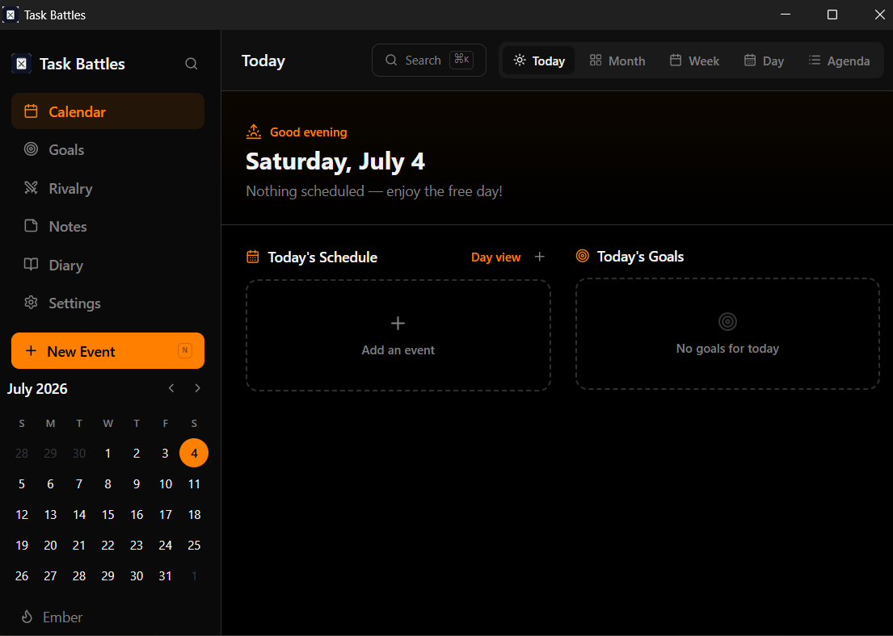
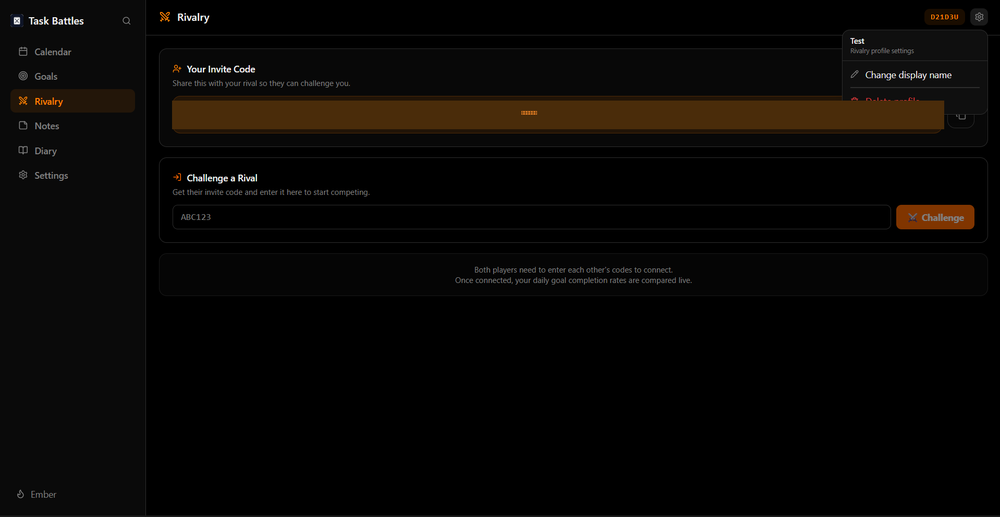
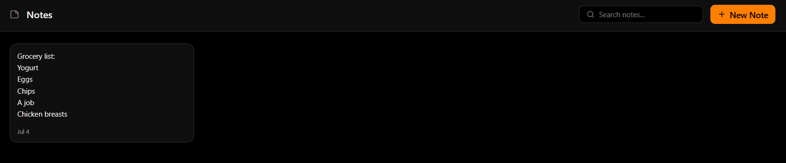
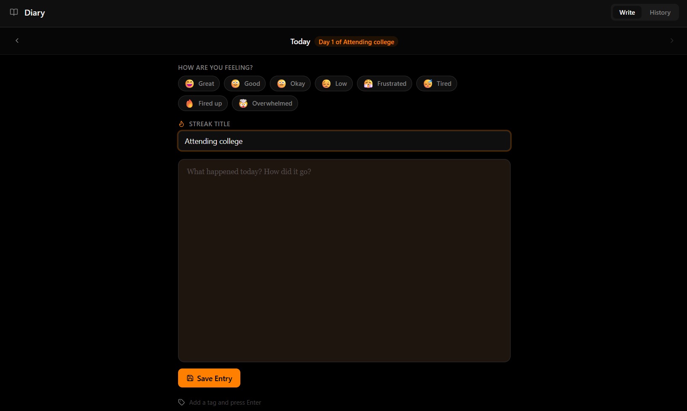
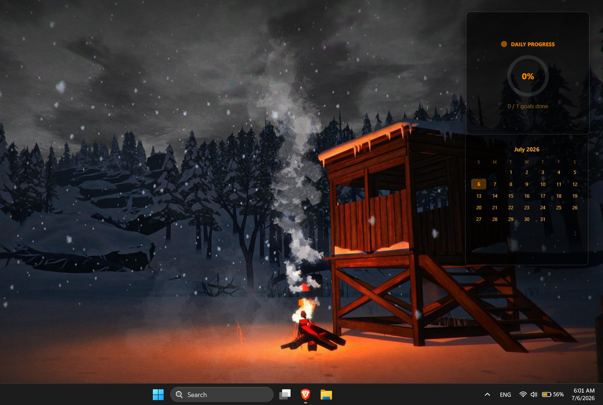
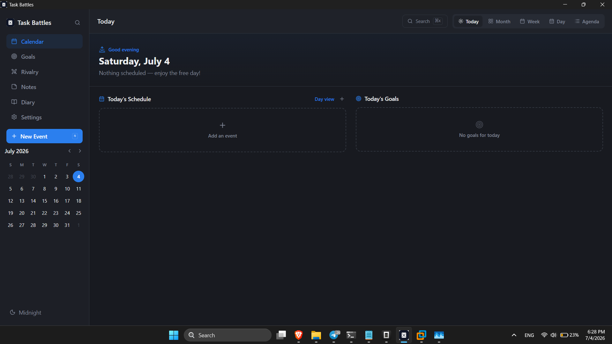
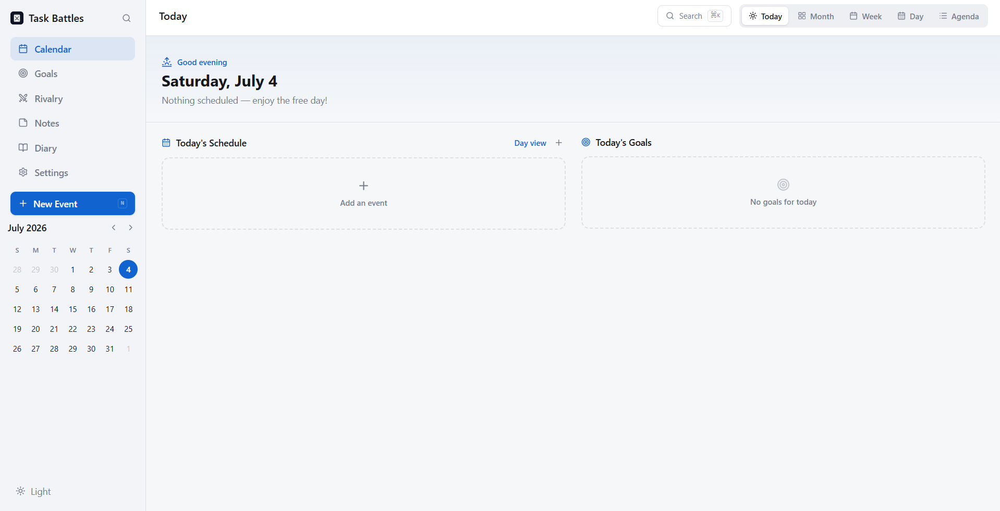

# Task Battles

A to-do app that lets you compete with your friends on who finishes more tasks. Plan your day, track goals, and battle it out on a shared leaderboard — with a floating widgets companion that keeps your progress visible on your desktop at all times.


## Themes

Ember, Midnight, and Light — pick whichever fits your desktop.


## Features

- **Task planning** — organize goals, events, and daily tasks in one place
- **Rivalry mode** — compete with friends on task completion
- **Floating widgets** — an always-on-top, transparent companion app that sits in your system tray and shows live progress without needing the main app open
- **Cross-platform** — native desktop builds for Windows, macOS, and Linux

<table>
<tr>
<td width="33%"><br/><sub>Goals</sub></td>
<td width="33%"><br/><sub>Rivalry — challenge friends by invite code</sub></td>
<td width="33%"><br/><sub>Notes</sub></td>
</tr>
</table>

## Screenshots

<table>
<tr>
<td width="50%">

**Calendar**


</td>
<td width="50%">

**Goals**


</td>
</tr>
<tr>
<td width="50%">

**Rivalry**


</td>
<td width="50%">

**Notes**


</td>
</tr>
</table>

**Diary**


## Floating Widgets

Widgets sit directly on your desktop — transparent, always-on-top, and live-updating — so you can see your progress without opening the app.



## Themes

Choose between three built-in themes, applied across both the main app and widgets.

<table>
<tr>
<td width="33%" align="center"><b>Ember</b><br></td>
<td width="33%" align="center"><b>Midnight</b><br></td>
<td width="33%" align="center"><b>Light</b><br></td>
</tr>
</table>

## Download

Grab the latest build for your platform from the [Releases page](https://github.com/m-coder7/task-battles/releases):

| Platform | File |
|---|---|
| Windows | `TaskBattles-Windows-Setup.exe` |
| macOS (Apple Silicon) | `TaskBattles-macOS.dmg` |
| Linux | `TaskBattles-Linux.AppImage` |

Each installer sets up both the main app and the widgets companion — the widgets app runs quietly in the background and starts automatically.

## Tech stack

- **Frontend:** TypeScript, React, Vite
- **Desktop shell:** [Tauri](https://tauri.app/) (Rust)
- **Backend:** Supabase
- **Monorepo tooling:** pnpm workspaces

## Project structure

```
artifacts/
├── planner/                 # Main desktop app (task planning, goals, rivalry)
├── task-battles-widgets/    # Floating widgets companion app (tray-only, auto-starts)
├── api-server/              # Backend API (WIP)
├── day-planner-mobile/      # Mobile app experiment (WIP)
└── mockup-sandbox/          # Design/prototyping sandbox
```

The planner and widgets companion are the two apps that ship in releases today. The other folders are in-progress experiments.

## Development

**Requirements:** Node.js, [pnpm](https://pnpm.io/), Rust + Cargo (for Tauri builds)

```bash
# Install dependencies
pnpm install

# Run the planner app in dev mode
cd artifacts/planner
pnpm run tauri:dev

# Run the widgets companion app in dev mode
cd artifacts/task-battles-widgets
pnpm run tauri:dev
```

### Building locally

```bash
# From artifacts/planner or artifacts/task-battles-widgets:
pnpm run tauri:build            # current platform
pnpm run tauri:build:win        # Windows
pnpm run tauri:build:mac        # macOS (Apple Silicon)
pnpm run tauri:build:mac:intel  # macOS (Intel)
pnpm run tauri:build:linux      # Linux
```

### Releases

Pushing a version tag (`v*.*.*`) triggers the GitHub Actions release pipeline, which builds both apps for Windows, macOS, and Linux and publishes them as a single bundled installer per platform.

## License

MIT — *(note: a `LICENSE` file isn't in the repo yet; add one at the root if you want this to be enforceable/visible to others.)*
